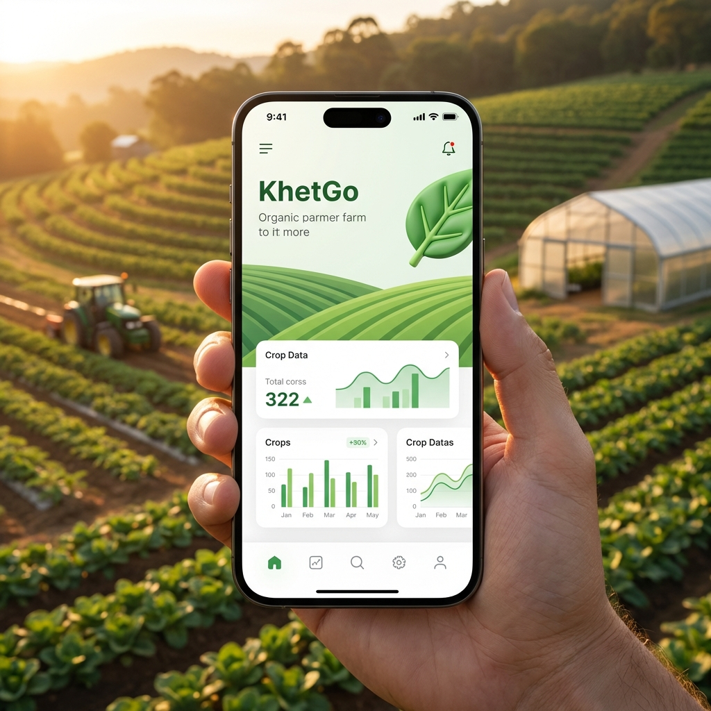
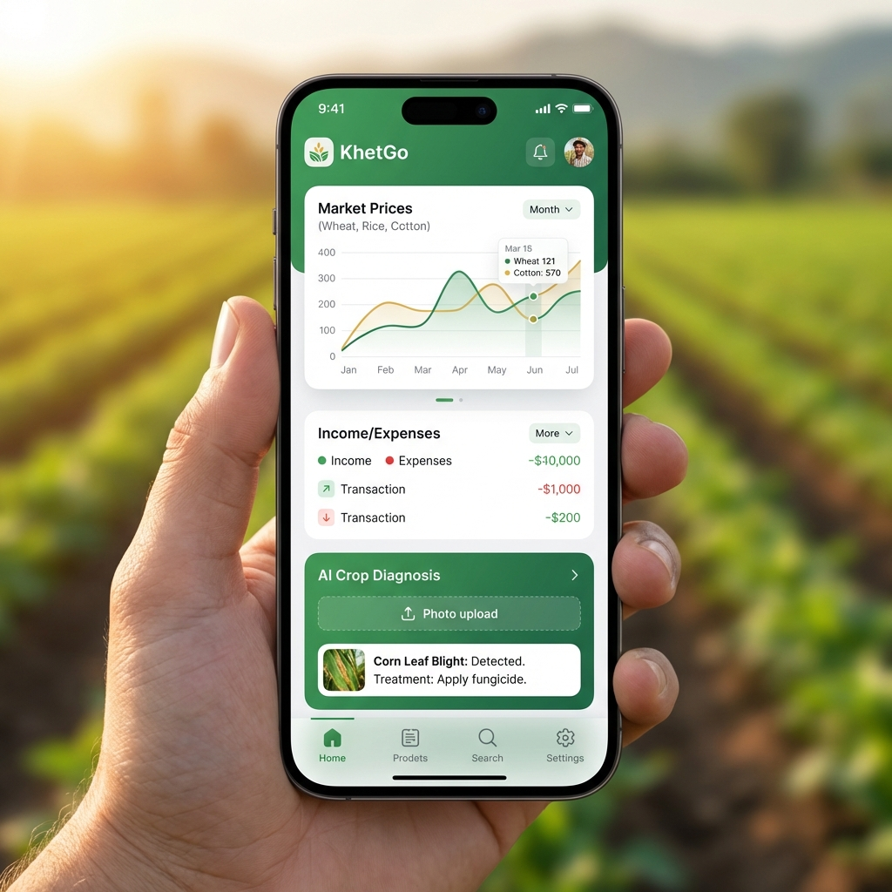

# 🌾 KhetGo: The Digital Pulse of Indian Farming

**KhetGo** is a comprehensive, all-in-one digital agricultural ecosystem designed to empower farmers and bridge the gap between rural production and urban demand. Built with a focus on stability, premium UI/UX, offline support, and regional accessibility.

[](https://choosealicense.com/licenses/mit/)
[](https://web.dev/progressive-web-apps/)
[](https://github.com/Coderaryanyadav/KhetGo)

[](https://vercel.com/new/clone?repository-url=https%3A%2F%2Fgithub.com%2FCoderaryanyadav%2FKhetGo)

---

## ✨ Key Features

### 🛒 **Smart Marketplace**
- **Direct Trading**: Connect directly with buyers without middlemen
- **GPS-Based Discovery**: Find the nearest crops and produce with real-time distance calculation
- **Verified Farmers**: Built-in verification badges for trust and quality assurance
- **Smart Filters**: Filter by price, location, crop type, and distance
- **Real-time Notifications**: Get instant updates on new listings

### 🧠 **AI Agri-Advisor**
- **Instant Diagnosis**: Describe crop symptoms in natural language and receive automated expert guidance
- **Disease Management**: Get instant solutions for pests and nutrient deficiencies
- **Powered by Google Gemini**: Free-tier AI integration
- **Multilingual Support**: Ask questions in English, Hindi, or Marathi

### 📒 **Farmer's Digital Khata**
- **Financial Tracking**: A full digital ledger to record income and expenses
- **Profit Analytics**: Automatic calculation of net profit and loss with visual charts
- **PDF Export**: Generate professional financial statements for bank loans or personal records
- **Category-wise Analysis**: Track expenses by seeds, fertilizer, labor, equipment, etc.

### 🎓 **KhetGo Academy**
- **Video Tutorials**: Learn modern farming techniques like drip irrigation and organic composting
- **Best Practices**: Expert guidance on crop rotation, soil management, and pest control
- **Continuous Learning**: Regularly updated content for sustainable farming

### 🌦️ **Weather Integration**
- **Real-time Weather**: Location-based agricultural weather data
- **7-Day Forecast**: Plan your farming activities ahead
- **Weather Alerts**: Get notified about extreme weather conditions
- **Powered by OpenWeatherMap**: Free-tier integration

### 🌐 **Multilingual Support (i18n)**
- Fully translated interface supporting **English**, **हिन्दी (Hindi)**, and **मराठी (Marathi)**
- Easy language switching from the sidebar
- More languages coming soon (Tamil, Telugu, Kannada, Bengali, Gujarati, Punjabi)

### 📱 **Progressive Web App (PWA)**
- **Installable**: Add to home screen on mobile devices
- **Offline Support**: Core features work without internet
- **Push Notifications**: Real-time updates for marketplace activities
- **App-like Experience**: Full-screen mode with native feel
- **Background Sync**: Auto-sync data when connection is restored

### 🛡️ **Admin Control Panel**
- **Platform Moderation**: Manage users and moderate marketplace listings
- **Live Price Management**: Update mandi prices in real-time across the platform
- **System Metrics**: Overview of platform growth and revenue flow
- **Bypass Access**: Demo access with `admin` / `admin` credentials

### 🔗 **Social Sharing**
- Share listings directly to WhatsApp, Facebook, Twitter
- Generate shareable links for products
- Built-in share target for receiving shared content

---

## 🛠️ Tech Stack

- **Frontend**: Vanilla JavaScript (ES6+), Vite
- **Backend/Database**: Supabase (PostgreSQL + Auth + Storage + Realtime)
- **Styling**: Modern CSS with Glassmorphism & Responsive Design
- **Data Visualization**: Chart.js for financial analytics
- **AI Integration**: Google Gemini API (free tier)
- **Weather API**: OpenWeatherMap (free tier)
- **Financial Reports**: jsPDF & AutoTable
- **PWA**: Service Workers with offline caching
- **Deployment**: Vercel with custom routing

---

## 🚀 Getting Started

### 1. Prerequisites
- [Node.js](https://nodejs.org/) (v16+)
- A [Supabase](https://supabase.com/) Account (free tier)
-Google Gemini API Key ([Get it here](https://makersuite.google.com/app/apikey))
- OpenWeatherMap API Key ([Get it here](https://openweathermap.org/api))

### 2. Installation

```bash
# Clone the repository
git clone https://github.com/Coderaryanyadav/KhetGo.git
cd KhetGo

# Install dependencies
npm install
```

### 3. Environment Setup

Create a `.env` file in the root directory:

```env
# Supabase (Required)
VITE_SUPABASE_URL=your_supabase_url
VITE_SUPABASE_ANON_KEY=your_supabase_anon_key

# AI Agri-Advisor (Choose one)
VITE_GEMINI_API_KEY=your_gemini_api_key

# Weather (Optional)
VITE_OPENWEATHER_API_KEY=your_openweather_key

# Default Location (Optional)
VITE_DEFAULT_CITY=Nagpur
VITE_DEFAULT_LAT=21.1458
VITE_DEFAULT_LNG=79.0882
```

```

Note: For testing and demonstration, use **`admin`** as username and **`admin`** as password to access the platform management portal.

### 4. Database Setup

1. Go to your [Supabase Dashboard](https://supabase.com/dashboard)
2. Open **SQL Editor**
3. Copy contents of [`SCHEMA.sql`](./SCHEMA.sql)
4. Run the SQL script
5. Create a **Public Bucket** named `listings` in Storage

### 5. Run Development Server

```bash
npm run dev
```

Visit `http://localhost:5173` to see the app!

### 6. Build and Optimize for Production

For a professional, production-ready build, we provide an automated build script that handles cleaning, dependency verification, and chunk optimization:

```bash
# Run the automated build and polish script
chmod +x build-polish.sh
./build-polish.sh

# Preview the optimized build
npm run preview
```

### 🛠️ Developer Workflows (Pro Tools)

If you are using an agentic environment (like Antigravity), use these integrated commands:
- **`/build`**: Execute the standard production build pipeline
- **`/deploy`**: Full checklist for Vercel/Supabase deployment

---

## 📸 Screenshots

*(Promotional images generated for demonstration)*


*Smart Marketplace with GPS-based filtering*


*Farmer Dashboard with Analytics*

---

## 📱 Mobile & PWA Support

### Install as App

**Android (Chrome):**
1. Open KhetGo in Chrome
2. Tap menu (⋮) → "Add to Home screen"
3. Enjoy the app experience!

**iOS (Safari):**
1. Open KhetGo in Safari
2. Tap Share button → "Add to Home Screen"
3. Launch from home screen!

### PWA Features
- ✅ Works offline for basic features
- ✅ Background sync when online
- ✅ Push notifications for marketplace updates
- ✅ Fast loading with service worker caching
- ✅ Responsive on all screen sizes (320px - 4K)

---

## 🔒 Security

- **HTTPS Enforced**: All API calls use encrypted connections
- **Row Level Security (RLS)**: Database-level access control in Supabase
- **JWT Authentication**: Secure session management
- **Input Sanitization**: Protection against XSS and injection attacks
- **Environment Variables**: API keys never exposed in code

See [SECURITY.md](./SECURITY.md) for security policies.

---

## �� Contributing

We welcome contributions from the community! Please read our [CONTRIBUTING.md](./CONTRIBUTING.md) for guidelines.

### How to Contribute
1. Fork the repository
2. Create a feature branch (`git checkout -b feat/amazing-feature`)
3. Commit changes (`git commit -m 'feat: add amazing feature'`)
4. Push to branch (`git push origin feat/amazing-feature`)
5. Open a Pull Request

---

## 📚 Documentation

- **[Changelog](./CHANGELOG.md)** - Version history and updates
- **[Security Policy](./SECURITY.md)** - Security best practices
- **[Contributing](./CONTRIBUTING.md)** - Contribution guidelines

---

## 🎯 Roadmap

- [x] Smart Marketplace with GPS
- [x] AI Agri-Advisor
- [x] Digital Khata (Ledger)
- [x] PWA Support
- [x] Offline Mode
- [x] Push Notifications
- [x] Social Sharing
- [x] Multilingual (3 languages)
- [ ] SMS Integration for farmers without smartphones
- [ ] Mobile App (React Native/Flutter)
- [ ] Integration with government schemes
- [ ] Crop price prediction using ML
- [ ] Community forum enhancements
- [ ] Voice command support
- [ ] IoT device integration

---

## 💡 Use Cases

- **Farmers**: Sell produce directly, track finances, get AI advice
- **Buyers**: Find fresh crops nearby, verify farmer authenticity
- **Agri-businesses**: Rent equipment, provide services
- **Students**: Learn modern farming techniques

---

## 📄 License

This project is licensed under the MIT License - see the [LICENSE](./LICENSE) file for details.

---

## 🙏 Acknowledgments

- Supabase for amazing backend-as-a-service
- Google Gemini for free AI API
- OpenWeatherMap for weather data
- Font Awesome for icons
- Chart.js for beautiful visualizations
- All contributors and testers

---

## 📞 Contact & Support

- **Developer**: Aryan Yadav
- **GitHub**: [@Coderaryanyadav](https://github.com/Coderaryanyadav)
- **Email**: [your-email@example.com]
- **Issues**: [GitHub Issues](https://github.com/Coderaryanyadav/KhetGo/issues)

---

**Built with ❤️ for the Indian Farmer.**

**Empowering Agriculture, One Click at a Time** 🌾

---

### ⭐ Star this repo if you find it helpful!

